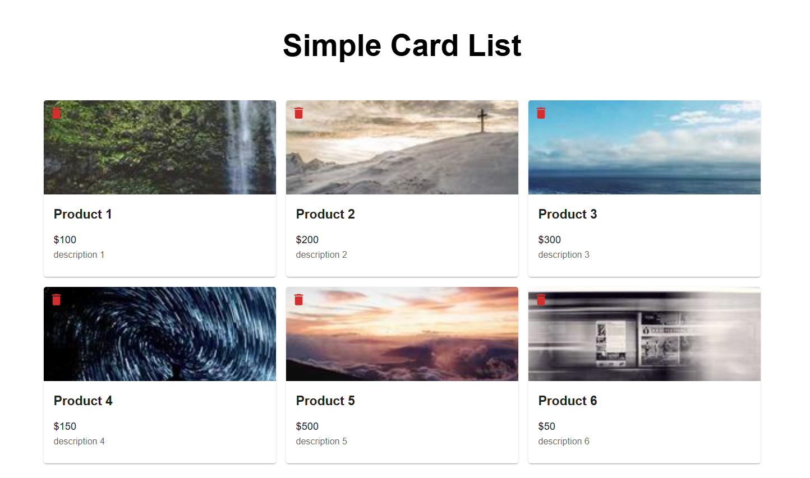

# Simple Card List Application

This repository contains the source code for the Simple Card List Application, a full-stack application built using React for the frontend and Express for the backend. The application allows users to browse cards with product information and delete products from the application.

## Frontend

### Features

- **Product Listing**: Displays a list of products with names, descriptions, prices, and images.
- **Product Deletion**: Allows users to delete individual products from the list.
- **Responsive Design**: The UI is styled to be responsive and user-friendly, built with Material UI.

### Technologies Used

- **React**: A JavaScript library for building user interfaces.
- **Axios**: A promise-based HTTP client for making API requests.
- **Material UI**: A popular UI component library for React applications.

## Backend

### Features

- **API for Products**: Provides endpoints to retrieve and delete products.
- **Product Data**: Initializes a set of sample products stored in-memory.

### Technologies Used

- **Express**: A fast, unopinionated web framework for Node.js.
- **CORS**: Middleware to handle Cross-Origin Resource Sharing (CORS).
- **Node.js**: A JavaScript runtime for backend development.

## Prerequisites

- Ensure that Node.js and npm are installed on your system.

## Setup and Installation


1. Clone the repository:

```
git clone https://github.com/DominicVCUENG/Simple-Card-List.git
```

**Backend**

2. Navigate to the backend directory:

```
cd Simple-Card-List/StarterCode/backend
```

3. Install backend dependencies:

```
npm install
```

4. Start the backend server:

```
npm start
```

**Frontend**

5. Navigate to the frontend directory:

```
cd Simple-Card-List/StarterCode/frontend
```

6. Install frontend dependencies:

```
npm install
```

7. Start the frontend development server:

```
npm start
```

## Usage

- Access the backend at `http://127.0.0.1:5000/`

- Access the frontend at `http://127.0.0.1:3000/`

## Screenshots


